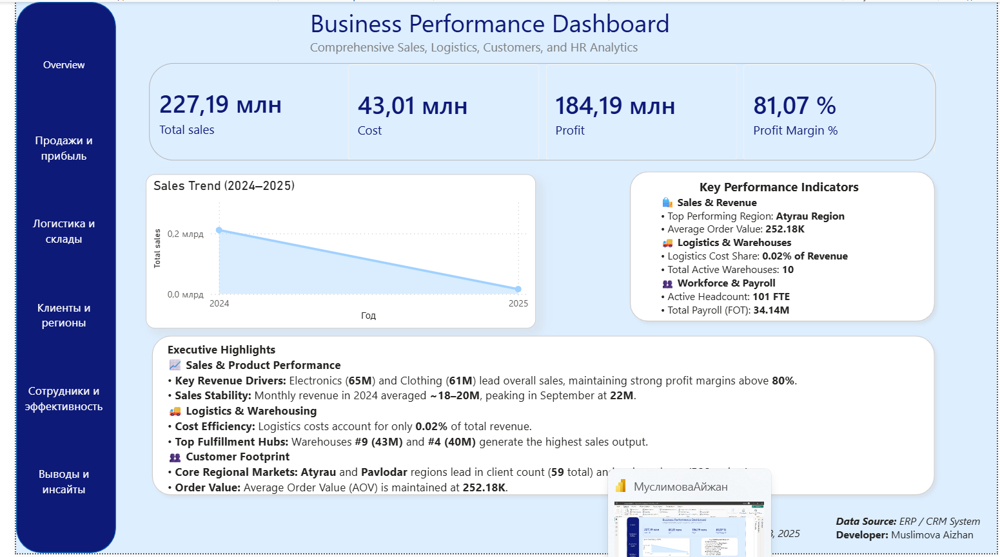

# Business Performance Dashboard
Sales, Logistics, Customer & Workforce Analytics
An interactive Power BI dashboard developed as part of my Data Analytics training to provide a comprehensive view of business performance across sales,
profitability, logistics, customers, regions and workforce.

Dashboard Overview
The dashboard is organized into several analytical areas:
* Overview — key business performance indicators and executive highlights
* Sales & Profitability — sales and revenue performance, product performance and key revenue drivers
* Logistics & Warehousing — warehouse performance, logistics indicators, cost efficiency and top fulfillment hubs
* Customers & Regions — customer footprint, regional markets and order value
* Workforce & Efficiency — employee performance and payroll-related indicators
* Insights & Conclusions — key findings and analytical insights

Key Performance Indicators
The dashboard includes indicators covering:
* Sales & Revenue
* Logistics & Warehouse Performance
* Workforce & Payroll
* Executive Highlights
* Sales & Product Performance
* Key Revenue Drivers
* Sales Stability
* Logistics & Warehousing
* Cost Efficiency
* Top Fulfillment Hubs
* Customer Footprint
* Core Regional Markets
* Order Value

Analytical Focus
The project demonstrates how multiple business areas can be combined into an interactive analytical dashboard to provide a consolidated view of business performance.
The analysis covers sales and profitability, operational logistics, warehouse performance, customer and regional patterns, and workforce-related indicators.

Tools
* Power BI
* DAX

  ## Dashboard Preview
  
* Data Modeling
* Data Visualization
* Business Analytics
* Data Visualization
* Business Analytics
